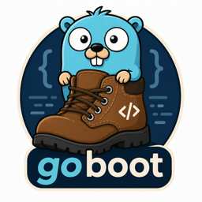

<div align="center">



# goboot

**An annotation-driven, _compile-time_ application framework for Go.**

A Spring Boot–style developer experience that compiles down to plain, readable Go —
no runtime reflection for DI, no classpath scanning.

[](https://zombocoder.github.io/goboot/)
[](https://pkg.go.dev/github.com/zombocoder/goboot)
[](https://github.com/zombocoder/goboot/releases)
[](https://go.dev/dl/)
[](LICENSE)

📖 **[Documentation](https://zombocoder.github.io/goboot/)** — developer guide & annotation reference.

</div>

You annotate ordinary Go types and methods; the `goboot` CLI reads the annotations,
builds a typed application model + dependency graph, validates it, and generates
**ordinary, readable Go**. Dependency resolution and wiring happen at *generation
time* — the program that ships does no reflection-based DI and no startup scanning,
and every dependency is checked with `go/types`, never strings.

```go
// @RestController
// @RequestMapping(path="/users")
type UserController struct{ users UserUseCase }

func NewUserController(users UserUseCase) *UserController { return &UserController{users} }

// @PostMapping(path="")
func (c *UserController) Create(ctx context.Context, req CreateRequest) (*UserResponse, error) {
    return c.users.Create(ctx, req.toInput())
}

// @Service(name="userService", implements="UserUseCase")
type UserService struct{ repo UserRepository }

func NewUserService(repo UserRepository) *UserService { return &UserService{repo} }

// @Transactional
// @Traced
// @Timed
// @Audit(action="create", resource="user")
func (s *UserService) Create(ctx context.Context, in CreateInput) (*User, error) { /* ... */ }

// @Repository(generate=true, entity="User", table="users")
type UserRepository interface {
    // @Query(`SELECT id, name FROM users WHERE id = :id`)
    FindByID(ctx context.Context, id string) (*User, error)
    // @Exec(`INSERT INTO users (id, name) VALUES (:u.ID, :u.Name)`)
    Insert(ctx context.Context, u User) error
}
```

```bash
goboot generate ./...
```

goboot emits the wiring: constructors in dependency order, HTTP routes + handler
proxies (bind → validate → authorize → invoke → write), the SQL repository
implementation, service proxies that apply your `@Transactional`/`@Traced`/…
interceptors, typed config loaders, lifecycle, scheduled tasks, and
`NewApplication` — all plain Go you can read and step through in a debugger.

## Quickstart

```bash
# 1. install the CLI
go install github.com/zombocoder/goboot/cmd/goboot@latest

# 2. scaffold config in your module
goboot init

# 3. annotate your code (see the example above), then generate
goboot generate ./...

# 4. wire the generated app in main.go and run
go run ./cmd/server
```

`goboot init` writes a `goboot.yaml`; `goboot generate` produces
`internal/generated/zz_goboot_wiring.gen.go` exposing `NewApplication(...)`,
`RegisterRoutes(...)`, and `buildComponents(...)`. Add a `go:generate` directive
for reproducible builds:

```go
//go:generate go run github.com/zombocoder/goboot/cmd/goboot generate ./...
```

## Features

| Area | Annotations |
| ---- | ----------- |
| **DI** | `@Application` `@Service` `@Component` `@Configuration` `@Nut` `@Primary` `@Named` `@Scope` |
| **HTTP** | `@RestController` `@RequestMapping` `@GetMapping` `@PostMapping` `@PutMapping` `@PatchMapping` `@DeleteMapping` `@Response` `@ResponseStatus` `@Consumes` `@Produces` |
| **Errors** | `@ControllerAdvice` `@ExceptionHandler` (typed → response), RFC-7807 `Problem` |
| **Repositories** | `@Repository(generate=true)` with `@Query` `@Exec` `@Batch` `@Call`; dialects: postgres, mysql, sqlserver, `?`; driver-neutral |
| **Interception** (proxies) | `@Transactional` `@Traced` `@Timed` `@Logged` `@Audit` `@Retry` `@Timeout` `@CircuitBreaker` `@RateLimit` `@Bulkhead` `@Authorize` `@RolesAllowed` |
| **Config & lifecycle** | `@ConfigurationProperties` `@PostConstruct` `@PreDestroy` `@Scheduled` |
| **Conditions & profiles** | `@Profile` `@ConditionalOnProperty` `@ConditionalOnNut` `@ConditionalOnMissingNut` |

Core invariants: **compile-time only**, **deterministic** output (byte-identical
for the same input), **type-safe** via `go/types`, and **diagnostics not panics**
(stable `GOB*` codes with source positions).

## Plugins & adapters

goboot is extended at **compile time** — plugins are Go modules linked into the
CLI (no dynamic loading). List them in `goboot.yaml` and `goboot generate`
self-bootstraps a plugin-aware build. Runtime adapters plug real backends into the
generated code's seams.

| Module | Kind | What it does |
| ------ | ---- | ------------ |
| [`plugins/openapi`](plugins/openapi) | Generator plugin | Emits an OpenAPI 3 spec from your routes |
| [`plugins/oracle`](plugins/oracle) | Dialect plugin | Oracle SQL dialect (`:1`, `:2`) |
| [`plugins/lint`](plugins/lint) | Analyzer plugin | REST convention warnings |
| [`adapters/pgx`](adapters/pgx) | DB adapter | Native PostgreSQL over `jackc/pgx/v5` |
| [`adapters/otel`](adapters/otel) | Tracing adapter | `@Traced` → OpenTelemetry spans |
| [`adapters/prometheus`](adapters/prometheus) | Metrics adapter | `@Timed` → Prometheus counters |

Write your own with `plugin.Plugin` + `AnnotationProvider` / `Analyzer` /
`Generator` / `DialectProvider`. Full guide: [PLUGINS.md](PLUGINS.md).

## Editor support

A [VS Code extension](editors/vscode) highlights goboot annotations inside Go doc
comments and ships annotation snippets. Install the `.vsix` from a
[release](https://github.com/zombocoder/goboot/releases) or search the Marketplace
for **goboot Annotations**.

## CLI

```bash
goboot init                       # scaffold goboot.yaml
goboot generate ./...             # generate wiring (+ plugin artifacts)
goboot validate ./...             # analyze and report diagnostics, no files written
goboot graph ./... --format mermaid
goboot plugins                    # list configured vs. linked plugins
goboot clean                      # remove generated files
goboot doctor                     # environment checks
goboot version
```

Useful flags on `generate`/`validate`: `-profile prod,staging`,
`-property cache.enabled=true`, `-dialect postgres|mysql|sqlserver|question`,
`-strict`, `-tags`.

## Status

**v0.1.0** — the core framework, plugin system, three plugins, three adapters, and
the VS Code extension are implemented and tested. See
[`CLAUDE.md`](CLAUDE.md) for an architecture overview and the package layout.

## Contributing

Contributions welcome — see [CONTRIBUTING.md](CONTRIBUTING.md) and the
[Code of Conduct](CODE_OF_CONDUCT.md). Security issues: [SECURITY.md](SECURITY.md).

## License

[Apache License 2.0](LICENSE).
